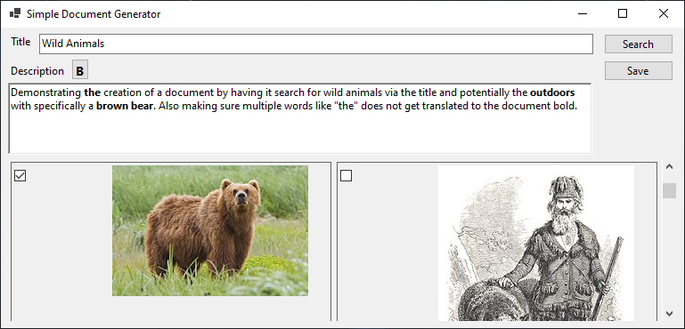
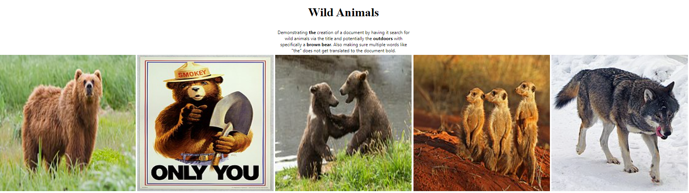

## Simple Document Generator

A quick and simple WinForms application put together for SEH America as a test.

## Example

1. Fill out form

2. Click Save button, choose a name and browse to a location to save
3. Open output

### Known Issues

Known issues will be kept here until fixed.

- Issue #: Smoothen loading bar animation by utilizing tasks and GUI thread synchronization correctly
- Issue #: Application uses a free Google custom search API, find an alternative way of searching
- Issue #: Multiple searches can consume quite a bit of memory as they keep adding more images to view, consider buffering

### Enhancement

Potential ideas fore future enhancement for fun.

- Make a front end Blazor application
- Utilize logging
- Enhance HTML output with style and responsiveness
- Offer Word (.docx) and (.pdf) outputs

## Open Source

A couple of open sourced libraries were used with respect to licensing.

- [Serilog](https://github.com/serilog/serilog) - A diagnostic logging library for .NET applications. It is easy to set up, has a clean API, and runs on all recent .NET platforms. While it's useful even in the simplest applications, Serilog's support for structured logging shines when instrumenting complex, distributed, and asynchronous applications and systems.
- [JSON.NET](https://www.newtonsoft.com/json) - A popular high-performance JSON framework for .NET
- [RazorLight](https://github.com/toddams/RazorLight) - Use Razor to build templates from Files / EmbeddedResources / Strings / Database or your custom source outside of ASP.NET MVC. No redundant dependencies and workarounds in pair with excellent performance and .NET Standard 2.0 and .NET Core 3.0 support.
- [RtfPipe](https://github.com/erdomke/RtfPipe) - RtfPipe is a .NET library for parsing Rich Text Format (RTF) streams and converting them to HTML. While initially adapted from the work started by Jani Giannoudis, it has been completely rewritten to support more features. When combined with the BracketPipe library, this library can also be used to convert RTF streams to various text format such as Markdown and Textile.

Microsoft .NET Core Extensions and Generic Hosting

As usual, always becareful using third party open source libraries. There is a handful of items to consider when using any of them.

## Thanks

Thank you for taking the time to look over the project. It was a fun little program to hack together with minimal requirements.